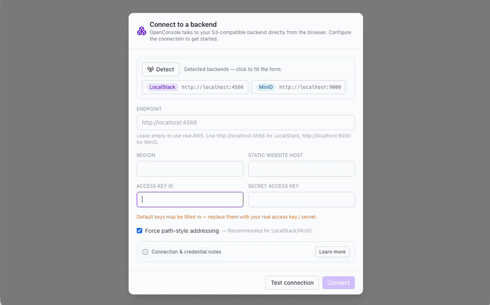

# OpenConsole

[](https://github.com/Jongsic/openconsole/actions/workflows/ci.yml)
[](https://github.com/Jongsic/openconsole/actions/workflows/deploy.yml)
[](LICENSE)

A **browser-only** console for **LocalStack, MinIO, or real AWS**.
There is no server: the browser talks to your endpoint directly using the AWS SDK. Connection
settings live in your browser's `localStorage`.



**Live:** [https://jongsic.github.io/openconsole/](https://jongsic.github.io/openconsole/)

> A fully functional app — **free, no sign-up, no account.** It is a static site that runs
> entirely in your browser; it sends **no data to any server of ours** and performs **no tracking
> or analytics.** Your endpoint and credentials never leave your browser.

- 🌐 UI in English / Korean (auto-detected from browser locale, switchable)
- 🔌 Connect to any endpoint from the settings dialog
- 🔎 Auto-detects the backend (LocalStack / MinIO / AWS) and gates features accordingly
- 🪣 Buckets: list / create / delete (with force)
- 📁 Objects: prefix browsing, upload (drag & drop), folders, text edit, download, delete
- ⚙️ Bucket properties (great for creating IaC drift): versioning, tags, encryption,
  static website (index/error docs), CORS, bucket policy, ARN

## Architecture: why browser-only

Because requests are made **from the visitor's browser**, the app can be hosted on a public domain
and still reach each visitor's own `localhost` backend — something a server-side app cannot do
(its "localhost" would be the server). The trade-off is that the **target backend must allow CORS**
from the app's origin (see below).

| Deploy | How | Notes |
| --- | --- | --- |
| Local run | `pnpm dev` or a static image on `localhost:PORT` | No mixed-content / PNA issues (all HTTP loopback). CORS still needed. |
| Public domain | Host `dist/` on any static host | Visitor configures their backend CORS. HTTPS→localhost may hit browser Private Network Access limits. |

## Backend support

| Backend | Support | Notes |
| --- | --- | --- |
| LocalStack | Full (S3 + EC2/ALB/ASG tabs) | Other service tabs enabled only when LocalStack is detected |
| MinIO | S3 only | Static website hosting / per-bucket CORS aren't implemented by MinIO's S3 API |
| Real AWS | S3 only | Leave the endpoint empty; use a least-privilege IAM key |

## ⚠️ CORS is required (read this)

Browser requests are subject to CORS. By default backends do **not** allow this app's origin.

**LocalStack** — add your app origin to the container, then restart:

```bash
# docker run / compose env
EXTRA_CORS_ALLOWED_ORIGINS=http://localhost:3939
# or, for local dev convenience:
DISABLE_CORS_CHECKS=1
```

**MinIO** — configure CORS / allowed origins on the server.

**Real AWS** — put a CORS configuration on the target bucket allowing this origin.

If the connection dialog shows a connection error, this is almost always the cause — the dialog
shows the exact env var to set.

## Run

```bash
pnpm install
pnpm dev        # http://localhost:3939
```

Build a static bundle for hosting:

```bash
pnpm build      # outputs dist/
pnpm preview    # serve dist/ locally
```

Set a sub-path base when hosting under one (GitHub Pages project sites):

```bash
VITE_BASE=/your-repo/ pnpm build
```

## Deploy to GitHub Pages

A workflow at `.github/workflows/deploy.yml` builds and deploys on every **signed release
tag** (`v*`), so the live site only updates from verified releases:

1. Push this repo to GitHub.
2. In the repo: **Settings → Pages → Build and deployment → Source: GitHub Actions**.
3. Register your signing key (see [Signed releases](#signed-releases) below).
4. Push a signed tag (or run the workflow manually). The app is served at
   `https://<user>.github.io/<repo>/`.

The workflow auto-computes the base path from the repo name and emits a `404.html`
SPA fallback so client-side routes work on refresh.

## Docker

A prebuilt image (nginx serving the static bundle) is published on each release:

```bash
docker run -p 3939:80 ghcr.io/jongsic/openconsole:latest
# → http://localhost:3939
```

Or build it yourself: `docker build -t openconsole . && docker run -p 3939:80 openconsole`.

## Releases

Tagging `v*` triggers `.github/workflows/release.yml`, which:

- publishes a GitHub Release with auto-generated notes,
- attaches the prebuilt static bundle (`*-static.zip`) and `SHA256SUMS.txt` — serve these with
  any static web server (opening `index.html` via `file://` will not work),
- pushes the Docker image to GHCR (and to Docker Hub if `DOCKERHUB_USERNAME` / `DOCKERHUB_TOKEN`
  secrets are set).

```bash
# bump the version in package.json, then:
git tag -s v0.1.0 -m v0.1.0 && git push origin v0.1.0
```

### Signed releases

Both the **release** and **Pages deploy** workflows are gated by a `verify-tag` job: the
triggering tag must carry a valid GPG signature from a trusted key. Tags that are unsigned
or signed by an unknown key are rejected before anything is published or deployed.

Create signed tags (`git tag -s ...`); set `git config --global commit.gpgSign true` and
`tag.gpgSign true` to sign by default.

### GitHub Actions configuration

Set these under **Settings → Secrets and variables → Actions**. Only `SIGNING_PUBLIC_KEY`
is required; the rest are optional or provided automatically.

| Name | Kind | Required | Used by | Purpose |
| --- | --- | --- | --- | --- |
| `SIGNING_PUBLIC_KEY` | Variable | **Yes** | release, deploy | Armored **public** GPG key the `verify-tag` gate trusts. Export with `gpg --armor --export <your-key-id>` and paste the whole block. |
| `DOCKERHUB_USERNAME` | Secret | No | release | Docker Hub user. Set (with the token) to also push the image to Docker Hub; omit to publish to GHCR only. |
| `DOCKERHUB_TOKEN` | Secret | No | release | Docker Hub access token paired with the username above. |
| `GITHUB_TOKEN` | — | Automatic | release, deploy | Provided by GitHub Actions; no setup. Used to create the Release, push to GHCR, and deploy Pages. |

No secrets are needed for **CI** (`ci.yml`) — it only lints, type-checks, tests, and builds.

## Settings (in-app, stored in localStorage)

| Field | Default | Notes |
| --- | --- | --- |
| Endpoint | `http://localhost:4566` | Empty = real AWS |
| Region | `us-east-1` | |
| Access key / Secret | `test` / `test` | Stored in plaintext in the browser — use limited keys |
| Force path-style | on | Recommended for LocalStack/MinIO |
| Static website host | `s3-website.localhost.localstack.cloud:4566` | Host that serves website hosting; backend-specific |

## Stack

React 18 + Vite, TypeScript (strict), Tailwind CSS, TanStack Query, Zustand, Zod,
react-router, react-i18next, `@aws-sdk/client-s3`, Biome. Tested with Vitest, CI via GitHub Actions.

## Disclaimer

This software is released into the public domain under [The Unlicense](LICENSE) and is provided
**"AS IS", without warranty of any kind**. Your credentials are stored in your browser's
`localStorage` in plain text and all requests are made directly from your browser to the endpoint
you configure. To the maximum extent permitted by law, the authors are **not liable** for any
damages, credential exposure, data loss, or cloud-provider charges arising from its use — **you
use it entirely at your own risk** and are solely responsible for securing your credentials, data,
and infrastructure. See [SECURITY.md](SECURITY.md) for details.

## License

[The Unlicense](LICENSE) — public domain. Do anything you want; no attribution required.

## Contributing

See [CONTRIBUTING.md](CONTRIBUTING.md).
